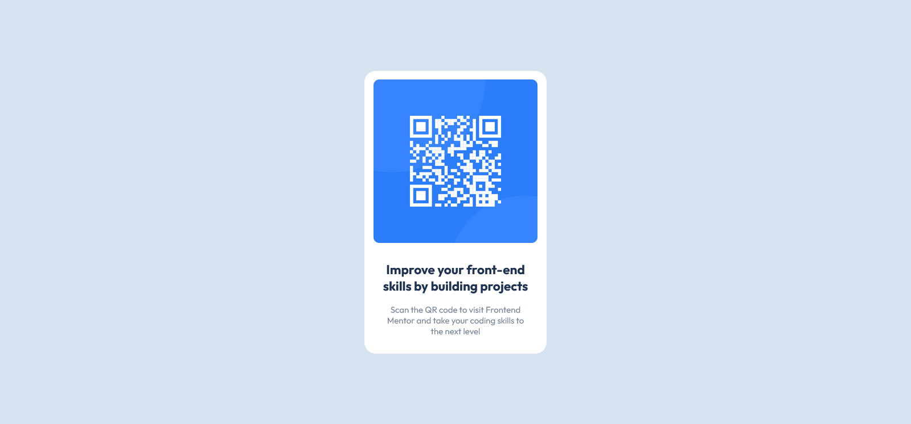

# Frontend Mentor - QR code component solution

This is a solution to the [QR code component challenge on Frontend Mentor](https://www.frontendmentor.io/challenges/qr-code-component-iux_sIO_H). Frontend Mentor challenges help you improve your coding skills by building realistic projects. 

### Screenshot

### Links

- Solution URL: [repo](https://github.com/reynoldArun/qr-code-component-main)
- Live Site URL: [live demo](https://luminous-kashata-21fdfc.netlify.app/)

### Built with

- Semantic HTML5 markup
- CSS

### What I learned

-HTML
-CSS
-Github
